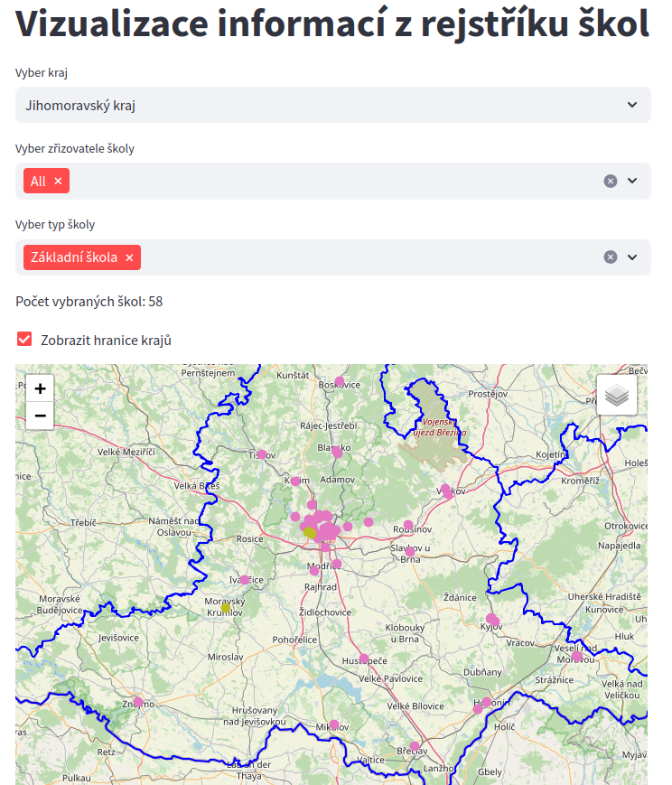

# web_scraping_rejstriku_skol
Stahování informací o školách z rejstříku škol.

app.py je jednoduchá streamlit aplikace, která na mapě zobrazí školy dle zvoleného filtru.
Ukázka dat je v celk_df_f.csv.

